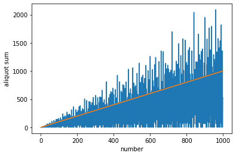

```python
from perfect import factorization, aliquot_sum
import numpy as np
from matplotlib import pyplot as plt
import seaborn as sns

%matplotlib inline
```


```python
aliquot_sum(999999)
```


    1042881


```python
def compare_sum_to_num(limit):
    x = list(range(1, limit))
    y = [aliquot_sum(n) for n in x]

    plt.plot(x, y)
    plt.xlabel("number")
    plt.ylabel("aliquot sum")
    plt.plot(x,x)
    plt.show()
```


```python
compare_sum_to_num(100)
```


```python
compare_sum_to_num(1000)
```





```python

```
